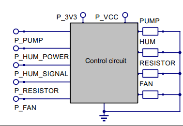
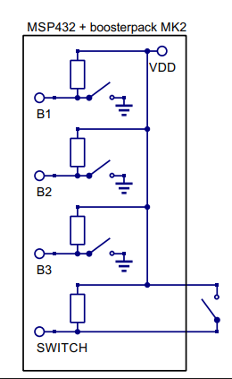
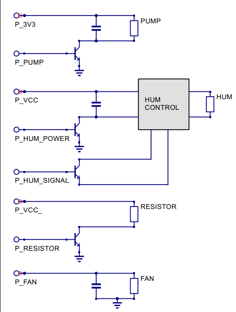

# Greenhouse - MSP432 Greenhouse Automation System

This project implements a complete control system for an automated greenhouse based on the TI MSP432P401R microcontroller. The system monitors temperature and humidity, automatically managing actuators (fans, pumps, heating resistors, humidifiers) to maintain ideal environmental conditions, or allowing for direct manual control.

## Key Features

- **Environmental Monitoring**: Precise reading of Temperature and Humidity via DHT22 sensor.
- **Finite State Machine (FSM)**: Logic management through few simple states.
- **Automatic Mode**:
  - Temperature regulation.
  - Humidity regulation.
  - Automatic watering cycle.
- **Manual Mode**: Direct control of each individual actuator via physical buttons.
- **User Interface**: Data visualization and configuration menus on Crystalfontz 128x128 LCD display.

## Hardware Requirements

- **Microcontroller**: TI MSP-EXP432P401R LaunchPad.
- **Display**: Integrated in Educational BoosterPack MKII.
- **Sensors**: DHT22 (Temperature and Humidity).
- **Actuators**:
  - DC Fan.
  - Water Pump (CJWP08 or similar; if a different pump is used, flow must be adjusted to dispense the correct amount of water).
  - Heating Resistor.
  - Humidifier Module.
- **Input**: 3 physical buttons (integrated in BoosterPack) and external lever.

## Pin Configuration

Pins are defined in `source/hardware.c`. The pin configuration used in this project is the following:

| Peripheral        | MSP432 Port/Pin | Notes                     |
| :---------------- | :-------------- | :------------------------ |
| DHT22 Sensor      | `P3.0`          | Requires pull-up resistor |
| Fan               | `P2.5`          | Output Active High        |
| Pump              | `P2.7`          | Output Active High        |
| Resistor          | `P3.2`          | Output Active High        |
| Humidifier power  | `P4.3`          | Not used                  |
| Humidifier signal | `P4.7`          | Pulse control             |
| Button B1         | `P5.1`          | Up / Increment            |
| Button B2         | `P3.5`          | Down / decrement          |
| Button B3         | `P4.1`          | Settings (Joystick)       |
| Man/Auto switch   | `P6.4`          | Mode selection lever      |

To supply power to power-hungry peripherals (fan, pump, resistor, humidifier power) an external transistor is used. The signal from the board opens the gate, aiming at reaching saturation to drive the actuators.

Here some example ciruits.

### System High-Level Block Diagram



### Input Interface Schematic (Buttons/Switches)



### Complete Circuitry Scheme



## Project Structure

The most important files are organized as follows:

```text
.
├── LcdDriver  --> Contains all useful file for the LCD display
│   ├── Crystalfontz128x128_ST7735.c
│   ├── Crystalfontz128x128_ST7735.h
│   ├── HAL_MSP_EXP432P401R_Crystalfontz128x128_ST7735.c
│   └── HAL_MSP_EXP432P401R_Crystalfontz128x128_ST7735.h
├── README.md --> Current file
├── include
│   ├── dht22.h
│   ├── hardware.h
│   ├── states.h
│   └── ui.h
├── source
│   ├── dht22.c
│   ├── hardware.c
│   ├── main.c
│   ├── states.c
│   ├── test_main.c
│   └── ui.c
├── tests
│   ├── TESTS.md
│   ├── test_hum.c
│   ├── test_main.c
│   ├── test_ui.c
│   └── test_simple_hw.c
```

## How to Use

### Manual Mode

Activated via the physical switch.

- Use **B1** (Up) to turn ON the selected component.
- Use **B2** (Down) to turn OFF the selected component.
- Use **B3** (Joystick) to cycle through components (Fan -> Humidifier -> Resistor -> Pump -> Fan).

The selected component will be printed on the screen, as well as its status and the next item in the cycle.

### Automatic Mode

Activated via the physical switch.

The system reads the sensors every 3 seconds, and updates the hardware status at every change to keep temperature and humidity stable. A fuzzy boundary is used to prevent excessively frequent updates.

Watering happens once every 12 hour, delivering half of the total target daily water level.

#### Settings

Allows configuration of target values for Temperature, Humidity, and Water quantity. The current quantity will be printed on screen, and can be adusted with B1 and B2 (up, down). If the maximum or minimum value is reached, the target will not change and `MAX` or `MIN` will be displayed.

In order to turn off the humidifier, the resistor or the watering feature, it is sufficient to set the respective target value to 0.

## Compilation and Testing

### Software Requirements

- **IDE**: Code Composer Studio (CCS).
- **SDK**: SimpleLink MSP432 SDK (DriverLib).

### Running the Test Suite

The project includes a test mode to verify logic without hardware (`test_main.c`).
To compile on Linux/gcc for logic tests:

```bash
gcc -DTEST_MODE source/test_main.c source/states.c source/hardware.c source/dht22.c -o greenhouse_test
./greenhouse_test
```

Hardware tests (`test_hum.c`, `test_ui.c` and `test_simple_hw.c`) verify that the external devices are working as expected. In order to run these tests, the content of the test files must be run as if they were the main file. The expected output is printed on the console.
